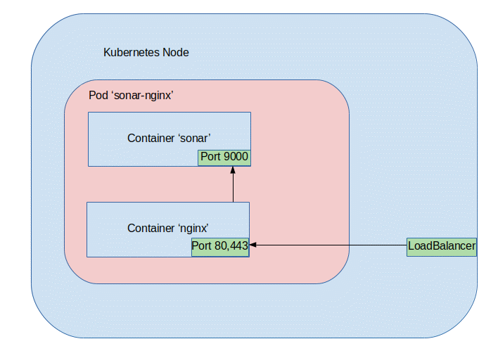

# Procedure
* To better group and manage the components of the solution it is recommended to create a dedicated namespace in the cluster:
```  
kubectl create namespace sonar
```
* Go to the folder that you have cloned the source code
* To create the PV claims for SonarQube server, run the following command:
```  
kubectl apply -n sonar -f sonar-data-pv-claim.yml -n sonar -f sonar-temp-pv-claim.yml -n sonar -f sonar-ext-pv-claim.yml
```
* To create deployments, services and the PVC for postgres, run the following command: 
```  
kubectl apply -n sonar -f sonar-postgres-svc.yml -n sonar -f config-nginx.yml -n sonar -f sonar-nginx-pod.yml
```

# Self-signed certificates
Step 1: Create self-signed certificates

```  
openssl req -new -newkey rsa:2048  \
    -nodes -x509 -subj '/CN=my-sonarqube.private' -days 1800 \
    -keyout tls.key \
    -out tls.crt
```  

Step 2: Import the TLS certificate and key as Secret

```  
kubectl -n sonar create secret tls yourdomain-tls \
    --cert="tls.crt" --key="tls.key"
```  

# SSO for GitLab - Import GitLab SSL certificate

On your server import Gitlab SSL certificate into the JRE used by SonarQube


If you don't already have you certificate on the SonarQube server, run openssl s_client -connect my-gitlab.com:443 -showcerts > /home/${USER}/my-gitlab.crt

Import it into your JRE cacerts (you can check from the "System Info" page in the Administration section of your sonarqube instance), running sudo $JDK8/bin/keytool -import -file ~/my-gitlab.crt -keystore $JDK8/jre/lib/security/cacerts -alias my-gitlab.

Restart your SonarQube instance.

* Note: This is done automatically in sonar-nginx-pod.yml with the following postStart handler:
 
```
command: ["/bin/sh", "-c", "echo | openssl s_client -connect my-sonarqube.private:443 -showcerts  > /etc/ssl/my-gitlab.crt && keytool -import -v -trustcacerts -alias my-gitlab -file /etc/ssl/my-gitlab.crt -keystore /usr/lib/jvm/java-8-openjdk-amd64/jre/lib/security/cacerts -keypass changeit -storepass changeit -noprompt"]
```
# Communication Between Containers

Containers in sonar-nginx Pod are accessible via "localhost", they use the same network namespace.   
Nginx in one container works as a reverse proxy for the sonar web application running in the second container.


